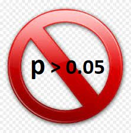

```{r setup, include=FALSE}

knitr::opts_chunk$set(echo = TRUE)

library(dplyr)
library(compareGroups)
library(MatchIt)
library(Macedonia)
library(furrr)


```

## Descripció

matchit() is the main function of MatchIt and performs pairing, subset selection, and subclassification with the aim of creating treatment and control groups balanced on included covariates. MatchIt implements the suggestions of Ho, Imai, King, and Stuart (2007) for improving parametric statistical models by preprocessing data with nonparametric matching methods. MatchIt implements a wide range of sophisticated matching methods, making it possible to greatly reduce the dependence of causal inferences on hard-to-justify, but commonly made, statistical modeling assumptions. The software also easily fits into existing research practices since, after preprocessing with MatchIt, researchers can use whatever parametric model they would have used without MatchIt, but produce inferences with substantially more robustness and less sensitivity to modeling assumptions.

::: {style="font-size: 0.7em"}

matchit(formula,
        data = NULL,
        method = "nearest",
        distance = "glm",
        link = "logit",
        distance.options = list(),
        estimand = "ATT",
        exact = NULL,
        mahvars = NULL,
        antiexact = NULL,
        discard = "none",
        reestimate = FALSE,
        s.weights = NULL,
        replace = FALSE,
        m.order = NULL,
        caliper = NULL,
        std.caliper = TRUE,
        ratio = 1,
        verbose = FALSE,
        ...)

:::


::: {.notes}

caliper: for methods that allow it, the width(s) of the caliper(s) to use in matching. Should be a numeric vector with each value named according to the variable to which the caliper applies. To apply to the distance measure, the value should be unnamed. See the individual methods pages for information on whether and how this argument is used. The default is NULL for no caliper.

:::


## Comparatiu


```{r, echo=FALSE, warning=FALSE}
# MatchIt::matchit()


compareGroups::descrTable(treat ~ age + educ + race + nodegree + married + re74 + re75, 
                          data = lalonde, show.p.overall = F) %>%   
  export2md() %>% 
  kableExtra::kable_classic_2() %>% 
  kableExtra::kable_styling(font_size = 22)


```


## MatchIt

**Paquete MatchIt de R (version 4.4.0)**


```{r, echo=TRUE}

dt_temp<-lalonde %>% mutate(idp=1:n())

set.seed(123)

m.out1 <- matchit(treat ~ age + educ + race + nodegree + married + re74 + re75, 
                  exact = ~ race + married,
                  distance = "glm",
                  method = "nearest",
                  discard = "both",
                  ratio =  1,
                  caliper = .1,
                  # unit.id="idp",
                  data = dt_temp)


```

## MatchIt

**Paquete MatchIt de R (version 4.4.0)**

```{r,  echo=TRUE}

m.out1


pp<-summary(m.out1)
pp$nn

pp


```


## MatchIt

**Validación**

```{r}

# dades_matchit<-lalonde %>% bind_cols(ps=m.out1$weights) %>% filter(ps==1) %>% select(-ps)

dades_matchit<-get_matches(m.out1)

compareGroups::descrTable(treat ~ age + educ + race + nodegree + married + re74 + re75, 
                          data = dades_matchit, show.p.overall = F) %>%   
  export2md() %>% 
  kableExtra::kable_classic_2() %>% 
  kableExtra::kable_styling(font_size = 22)


```


## MatchIt

**Validación**



```{r}

# dades_matchit<-lalonde %>% bind_cols(ps=m.out1$weights) %>% filter(ps==1) %>% select(-ps)

dades_matchit<-get_matches(m.out1)

compareGroups::descrTable(treat ~ age + educ + race + nodegree + married + re74 + re75, 
                          data = dades_matchit, show.p.overall = T) %>%   
  export2md() %>% 
  kableExtra::kable_classic_2() %>% 
  kableExtra::kable_styling(font_size = 22)


```


## MatchIt

**Validación**

```{r}

Macedonia::covariate_plot(m.out1, subtitle="Grupo intervención vs Control")


```


## Muestreo por densidad de incidencia

**Matching individual/exacto**

Apareamiento por densidad de incidencia


::: {.incremental}

-   Diseño: Caso-control anidado / Cohorte dinámica (o abierta) 
-   Los controles se seleccionan a medida que se producen los casos (Matching on time)
-   Se construyen conjuntos de riesgo emparejados
-   Los controles pueden ser remuestrados(más de una vez por caso)
-   Los controles se pueden convertir en casos

:::

**Ejemplo: Cohorte dinámica**


```{r, echo=TRUE}


dat2<-Macedonia::match_density_incidence(dt=Macedonia::dat_test,
                          id="idp",
                          llistaPS=c("sex"),
                          eventcontrol=TRUE,
                          reemplacement=FALSE,
                          numcores=NA,
                          Ncontrols=1,
                          seed=123)
# dat$idp %>% length()
# dat2$idp %>% length()
dat2 %>% head() %>% select(-c(diabetes,heartdis,byear)) %>% kableExtra::kable() %>% 
  kableExtra::kable_classic_2() %>% kableExtra::kable_styling(font_size = 15)

```


::: {.notes}

- Aquí tenemos un ejemplo con las rutinas que programamos. 

- La tenemos dentro de un paquete que se llama Macedonia. Le tienes que tener en cuenta los potenciales casos, con sus fechas, y el resto es importante las fechas de censura, o sea hasta cuando un control puede ser seleccionado como pareja. 

- Por ejemplo si una persona fallece, a partir de este momento no se puede seleccionar. 

- También si un caso puede ser seleccionado como control, antes de serlo 
y si los controles puede son reemplazables o no. 

- Genera grupos a riesgo, de forma exacta, y como son procesos altamente intensivos computacionalmente, nosotros incluimos la posibilidad de trabajar en distintos nucleos del ordenador.  Ya que con Bases de datos grandes pueden tardar dias. 

- Otro parámetro es el de la semilla de aleatorización por si hay que repetir el proceso y que salga el mismo resultado. 


:::
## Muestreo por densidad de incidencia

**Ejemplo: Caso-Control**

```{r, echo=TRUE, warning=FALSE}

dades<-readRDS("dades_setMatch.Rds")
# data de censura en els casos com a molt la data de CAS 
dades<-dades %>% mutate(dtindex_control=ifelse(event==1,dtindex_case,dtindex_control))
llistaPS<-c("sexe","year_DM2","year_naix")

dt_aparellada<-match_density_incidence(dades,
                                       id="id",
                                       llistaPS=llistaPS,
                                       eventcontrol = T,
                                       reemplacement=F,
                                       Ncontrols = 10,
                                       seed=131)
dades %>% n_distinct("id")
dt_aparellada %>% n_distinct("id")
dt_aparellada %>% select(id,.caseid,.dtindex,.event,.n,Fecha_caso=dat_cas,llistaPS) %>% 
  mutate(.dtindex=lubridate::as_date(.dtindex)) %>% 
  head(5) %>% kableExtra::kable() %>% kableExtra::kable_classic() %>% kableExtra::kable_styling(font_size = 15)

```


```

Note that the `echo = FALSE` parameter was added to the code chunk to prevent printing of the R code that generated the plot.
